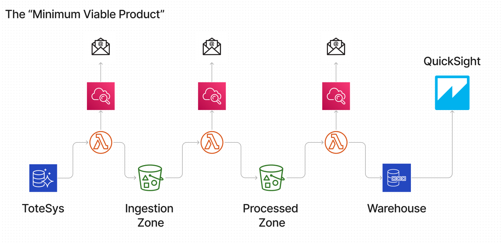

# The Data Engineering Project

## Objective

This project will create applications that will Extract, Transform, and Load data from a prepared source into a data lake and warehouse hosted in AWS. 
This solution should be reliable, resilient, and (as far as possible) deployed and managed in code.

The project consists of applications in Python that interact with AWS and database infrastructure and manipulate data as required.
It remodells data into a data warehouse hosted in AWS.
It is well-monitored and its performance can be measured.
The project has been deployed by using scripting and automation.

This project showcases knowledge of:
- Python
- SQL
- Dtabase modelling
- AWS
- Good operational practices
- Agile working

## The Minimum Viable Product (MVP)

The intention is to create a data platform that extracts data from an operational database (and potentially other sources), archives it in a data lake, and make it available in a remodelled OLAP data warehouse.

The project is open-ended and could include any number of features, but **at a minimum**, it should deliver the following:
- Two S3 buckets (one for ingested data and one for processed data). Both buckets should be structured and well-organised so that data is easy to find. Data should be **immutable** - i.e. once you have written data to S3, it should not be amended or over-written. You should create new data files containing additions or amendments.
- A Python application that continually ingests all tables from the `totesys` database (details below). The data should be saved in files in the "ingestion" S3 bucket in a suitable format. The application must:
  - operate automatically on a schedule
  - log progress to Cloudwatch
  - trigger email alerts in the event of failures
  - follow good security practices (for example, preventing SQL injection and maintaining password security)
- A Python application that remodels __at least some__ of the data into a predefined schema suitable for a data warehouse and stores the data in Parquet format in the "processed" S3 bucket. The application must:
  - trigger automatically when it detects the completion of an ingested data job
  - be adequately logged and monitored
  - populate the dimension and fact tables of a single "star" schema in the warehouse (see details below) 
- A Python application that loads the data into a prepared data warehouse at defined intervals. Again the application should be adequately logged and monitored.
- A Quicksight dashboard that allows users to view useful data in the warehouse (more on this below).

All Python code is thoroughly tested, PEP8 compliant, and tested for security vulnerabilities with the `safety` and `bandit` packages. Test coverage exceeds 90%.

The project is deployed automatically using infrastucture-as-code and CI/CD techniques.  

A change to the source database will be reflected in the data warehouse within 30 minutes at most.

## The Data

The primary data source for the project is a moderately complex (but not very large) database called `totesys` which is meant to simulate the back-end data of a commercial application. Data is inserted and updated into this database several times a day. (The data itself is entirely fake and meaningless, as a brief inspection will confirm.)

This project has read-only access credentials to this database. The full ERD for the database is detailed [here](https://dbdiagram.io/d/6332fecf7b3d2034ffcaaa92).

This project has credentials for a data warehouse hosted in the Northcoders AWS account. The data will be remodelled for this warehouse into one of these three overlapping star schemas. The ERDs for these star schemas can be found here:
 - ["Sales" schema](https://dbdiagram.io/d/637a423fc9abfc611173f637)
 - ["Purchases" schema](https://dbdiagram.io/d/637b3e8bc9abfc61117419ee)
 - ["Payments" schema](https://dbdiagram.io/d/637b41a5c9abfc6111741ae8)

The overall structure of the resulting data warehouse is shown [here](https://dbdiagram.io/d/63a19c5399cb1f3b55a27eca).

The tables to be ingested from `totesys` are:
|tablename|
|----------|
|counterparty|
|currency|
|department|
|design|
|staff|
|sales_order|
|address|
|payment|
|purchase_order|
|payment_type|
|transaction|

The list of tables in the complete warehouse is:
|tablename|
|---------|
|fact_sales_order|
|fact_purchase_orders|
|fact_payment|
|dim_transaction|
|dim_staff|
|dim_payment_type|
|dim_location|
|dim_design|
|dim_date|
|dim_currency|
|dim_counterparty|

However, this project only populates the following:
|tablename|
|---------|
|fact_sales_order|
|dim_staff|
|dim_location|
|dim_design|
|dim_date|
|dim_currency|
|dim_counterparty|

This should be sufficient for a single [star-schema](https://dbdiagram.io/d/637a423fc9abfc611173f637).

The structure of the "processed" S3 data reflects these tables.

Note that data types in some columns have been changed to conform to the warehouse data model.

### History
The warehouse contains a full history of all updates to _facts_. For example, if a sales order is 
created in `totesys` and then later updated (perhaps the `units_sold` field is changed), there should be _two_ 
records in the `fact_sales_order` table. It should be possible to see both the original and changed number
of `units_sold`. It should be possible to query either the current state of the sale, or get a full history
of how it has evolved (including deletion if applicable).

It is _not_ necessary to do this for dimensions (which should not change very much anyway). The warehouse 
should just have the latest version of the dimension values. However, you might want to keep a full
record of changes to dimensions in the S3 buckets.

## The Dashboard
To demonstrate the use of the warehouse, display some of the data can be done on an [AWS Quicksight](https://aws.amazon.com/quicksight/) dashboard.
There is no need to construct a Quicksight dashboard. A Northcoders tutor will helped with this part. 
However, we supplied several SQL queries to retrieve some insights from the data.

## Possible Extensions

The MVP can be enhaced. The initial focus for any enhancement should be to ensure that all of the tables in the data warehouse are being updated. Other desirable features can be added, such as a _schema registry_ or [data catalogue](https://www.alation.com/blog/what-is-a-data-catalog/) that contains the schema of the data ingested from the database. Using this, incoming data can be checked to have the required structure. If there is any anomaly (eg the database has been changed in some way), a failure action can be performed, such as redirecting the data to some sort of default destination (sometimes called a _dead letter queue_). 

Another simple addition (to make a presentation more visually appealing) could be a Jupyter Notebook that performs some kind of analysis of the data. (As previously noted, the data is random nonsense, there are not real insights, but it would be good to demonstrate knowledge of the tools.)

There are several ways to extend the scope of the project. 
1. Ingest data from an external API - eg retrieving relevant daily foreign exchange rates from `https://freeforexapi.com/Home/Api`. Using the `requests` library to make the request and then save the results in S3. Perhaps, incorporating this data into the warehouse schema?
2. Ingest data from a file source - eg another S3 bucket. Providing JSON files in a remote S3 bucket that can be fetched at intervals.
3. Create a metadata catalogue for the data in S3 so that it is accessible via Athena.
4. Orchestrate the pipeline with Prefect or similar tool.

## Technical Details

To host this solution, each team will need to host their infrastructure in a single AWS account. You can use one of your AWS accounts and give each member of your team credentials to access this. To deploy the infrastructure correctly it's better to script the creation of the resources so that they can be rebuilt as quickly and efficiently as possible.

### Required Components

Components to create:
1. A job scheduler to run the ingestion job. AWS Eventbridge is the recommended way to do this. Since data has to be visible in the data warehouse within 30 minutes of being written to the database, there is a need to schedule the ingestion job to check for changes much more frequently.
2. An S3 bucket that will act as a "landing zone" for ingested data.
3. A Python application to check for changes to the database tables and ingest any new or updated data. It is _strongly_ recommended to use AWS Lambda as computing solution. It is possible to use EC2, but it will be much harder to create event-driven jobs, and harder to log events in Cloudwatch. The data should be saved in the "ingestion" S3 bucket in a suitable format. Status and error messages should be logged to Cloudwatch.
4. A Cloudwatch alert should be generated in the event of a major error - this should be sent to email.
5. A second S3 bucket for "processed" data.
6. A Python application to transform data landing in the "ingestion" S3 bucket and place the results in the "processed" S3 bucket. The data should be transformed to conform to the warehouse schema (see above). The job should be triggered by either an S3 event triggered when data lands in the ingestion bucket, or on a schedule. Again, status and errors should be logged to Cloudwatch, and an alert triggered if a serious error occurs.
5. A Python application that will periodically schedule an update of the data warehouse from the data in S3. Again, status and errors should be logged to Cloudwatch, and an alert triggered if a serious error occurs.
6. Provide some SQL to perform a complex query on the data warehouse.
Deployment must be automated. It is strongly recommended to use Terraform.

## Finally...

This is a fairly realistic simulation of a typical data engineering project. In the real world, such a project would be undertaken over several weeks by a team of experienced data engineers. _It is highly unlikely that we will have time to complete a fully-functioning, "production-ready" solution._ However, we will have an opportunity to tackle lots of the typical problems faced in a real project and put our skills in Python, data, and DevOps to good use. As always, the journey is more important than the destination. 

Above all, we won't rush: it will be better to deliver a high-quality MVP than a more complex but poorly-engineered platform. 

Let's enjoy this!
